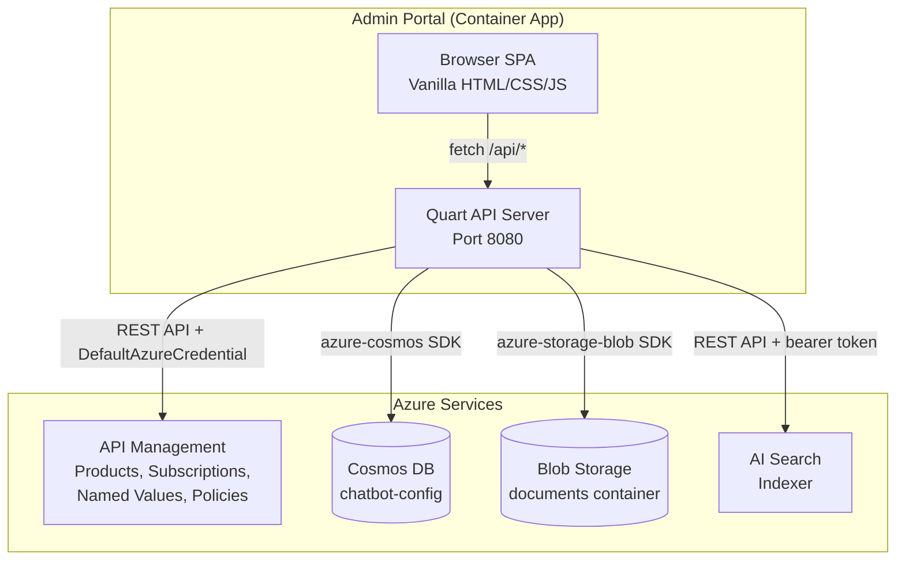

# Tenant Admin Portal

The Tenant Admin Portal is a web application that automates tenant onboarding for the multi-tenant RAG platform. Instead of running manual CLI commands to create APIM products, Cosmos DB configs, and upload documents, admins can do everything from a browser.

## High-Level Design



### Why a Separate App?

The admin portal runs as its own Container App (`admin-portal`), separate from the main `rag-app` backend, for three reasons:

1. **Network access**: `rag-app` is IP-restricted to APIM only — it cannot serve a browser UI.
2. **Security boundary**: Admin operations (creating APIM products, managing subscriptions) require different permissions than serving chat API requests.
3. **Existing pattern**: The platform already runs multiple Container Apps (rag-app, open-webui, librechat). The admin portal follows the same pattern.

### Authentication

The admin portal authenticates to Azure services using a user-assigned managed identity (`DefaultAzureCredential`). The identity has:

| Role | Scope | Purpose |
|------|-------|---------|
| API Management Service Contributor | APIM resource | Create/delete products, subscriptions, named values, update policies |
| Cosmos DB Built-in Data Contributor | Cosmos DB account | Read/write tenant config documents |
| Storage Blob Data Contributor | Storage account | Upload/delete document blobs |
| Search Index Data Reader | AI Search service | Trigger indexer, read indexer status |

## Tenant Creation Flow

When an admin creates a new tenant via the portal, the backend orchestrates seven steps:

```
1. Create Cosmos DB config document
   └─ chatbot-config container with system prompt, temperature, UI settings

2. Create APIM product
   └─ PUT /products/{tenant-id} — published, subscription required

3. Link rag-platform-api to the product
   └─ PUT /products/{tenant-id}/apis/rag-platform-api

4. Create APIM subscription
   └─ PUT /subscriptions/{tenant-id}-subscription

5. Retrieve subscription primary key
   └─ POST /subscriptions/{tenant-id}-subscription/listSecrets

6. Create APIM named value
   └─ PUT /namedValues/openai-key-{tenant-id} (secret, contains the sub key)

7. Update OpenAI API policy XML
   └─ GET policy → parse XML → insert <when> block → PUT with ETag
```

The subscription key is returned to the admin for configuring client applications (Open WebUI, LibreChat, custom frontends).

If any step fails, the response includes `stepsCompleted` so the admin knows which steps succeeded and can retry or clean up.

## API Routes

| Method | Path | Description |
|--------|------|-------------|
| `GET` | `/api/tenants` | List all tenant configurations |
| `POST` | `/api/tenants` | Create tenant (full orchestration) |
| `GET` | `/api/tenants/<id>` | Get tenant detail |
| `PUT` | `/api/tenants/<id>` | Update tenant config |
| `DELETE` | `/api/tenants/<id>` | Delete tenant + APIM resources |
| `POST` | `/api/tenants/<id>/documents` | Upload documents (multipart) |
| `GET` | `/api/tenants/<id>/documents` | List tenant documents |
| `DELETE` | `/api/tenants/<id>/documents/<name>` | Delete a document |
| `POST` | `/api/reindex` | Trigger the AI Search indexer |
| `GET` | `/api/indexer/status` | Get indexer run status |
| `GET` | `/health` | Health check |
| `GET` | `/` | Serve admin SPA |

## Frontend

The frontend is a vanilla HTML/CSS/JS single-page application with hash-based routing. No build step required — files are served directly by Quart from `app/admin/static/`.

Three views:

- **Tenant List** (`#/`): Table of all tenants with ID, name, colour swatch, and a link to the detail view.
- **Create Tenant** (`#/tenants/new`): Form to specify tenant ID, display name, system prompt, temperature, max tokens, welcome message, and primary colour. On success, displays the APIM subscription key with a copy button.
- **Tenant Detail** (`#/tenants/:id`): Two panels — configuration editor (save/delete) and document manager (upload via drag-and-drop, list, delete, trigger reindex).

## File Structure

```
app/admin/
├── app.py                    # Quart app, routes, orchestration
├── requirements.txt          # Python dependencies
├── Dockerfile                # Container image definition
├── services/
│   ├── __init__.py
│   ├── apim.py               # APIM REST API management
│   ├── cosmos.py             # Cosmos DB tenant config CRUD
│   ├── storage.py            # Blob Storage document management
│   └── search.py             # AI Search indexer operations
└── static/
    ├── index.html            # SPA shell
    ├── style.css             # Admin UI styles
    └── app.js                # Client-side SPA logic
```

## Infrastructure

The admin portal is defined in the Bicep infrastructure:

- **`infra/modules/apim.bicep`**: RBAC role assignment giving the managed identity API Management Service Contributor access.
- **`infra/modules/container-apps.bicep`**: `admin-portal` Container App resource with environment variables for all required services.
- **`infra/main.bicep`**: Threads subscription ID, resource group name, APIM name, and storage account name to the container-apps module.

### Environment Variables

| Variable | Description |
|----------|-------------|
| `COSMOS_ENDPOINT` | Cosmos DB endpoint URL |
| `COSMOS_DATABASE` | Database name (`rag-platform`) |
| `AZURE_SUBSCRIPTION_ID` | Azure subscription ID (for APIM REST API) |
| `RESOURCE_GROUP` | Resource group name |
| `APIM_NAME` | APIM resource name |
| `STORAGE_ACCOUNT_NAME` | Storage account name |
| `AZURE_SEARCH_ENDPOINT` | AI Search endpoint URL |
| `AZURE_CLIENT_ID` | Managed identity client ID |
