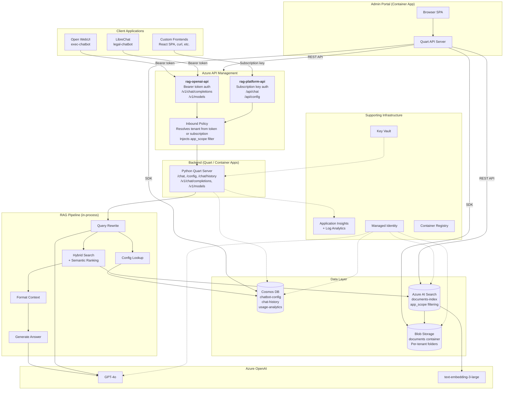

# Architecture

## Overview

The Multi-Tenant RAG Platform enables multiple isolated chatbot tenants to share a single Azure infrastructure deployment. Each tenant has its own system prompt, document corpus, and UI configuration while sharing compute, search, and AI resources.

Tenants are accessed through **any OpenAI-compatible client** (Open WebUI, LibreChat, custom apps) or via the platform's subscription-key API. A separate **Tenant Admin Portal** handles onboarding, configuration, and document management.

## Architecture Diagram



## Component Descriptions

### Client Applications

The platform supports **any OpenAI-compatible client** through its `/v1` API, plus a custom subscription-key API for bespoke integrations.

| Client | Tenant | Connection | Deployed At |
|--------|--------|-----------|-------------|
| [Open WebUI](https://github.com/open-webui/open-webui) | exec-chatbot | Bearer token via `/v1` | Container App |
| [LibreChat](https://github.com/danny-avila/LibreChat) | legal-chatbot | Bearer token via `/v1` | Container App + MongoDB sidecar |
| Custom React SPA | Any tenant | Subscription key via `/api` | `app/frontend/` (optional) |
| curl / Postman | Any tenant | Either API | N/A |

Open WebUI and LibreChat connect to the backend through APIM's **OpenAI-compatible API** (`rag-openai-api`), which accepts `Authorization: Bearer <key>` headers and maps them to tenant IDs via APIM named values. This means **any client that speaks the OpenAI API format works out of the box** — no custom integration needed.

The React SPA in `app/frontend/` is available for tenants that need a branded, embedded chat widget. It uses APIM subscription keys and the `/api` path.

### Tenant Admin Portal

A separate web application for tenant lifecycle management. Admins can create tenants, configure system prompts, upload documents, and trigger reindexing from a browser.

See [admin-portal.md](admin-portal.md) for the full design and [admin-portal-azure-setup.md](admin-portal-azure-setup.md) for Azure service integration details.

### Azure API Management (APIM)

The API gateway layer exposing **two API surfaces**:

| API | ID | Path | Auth | Clients |
|-----|-----|------|------|---------|
| RAG Platform API | `rag-platform-api` | `/api` | `Ocp-Apim-Subscription-Key` header | Custom frontends, direct API consumers |
| OpenAI-Compatible API | `rag-openai-api` | `/v1` | `Authorization: Bearer <key>` header | Open WebUI, LibreChat, any OpenAI-compatible client |

Both APIs route to the same Quart backend. The key difference is how tenant identity is resolved:

- **Subscription key API**: APIM reads `context.Product.Id` from the subscription context to determine the tenant.
- **Bearer token API**: APIM extracts the bearer token and matches it against APIM named values (`openai-key-{tenant-id}`) using a `<choose>` block in the inbound policy to resolve the tenant.

In both cases, the policy injects `context.app_id` into the request body so the backend applies the correct `app_scope` search filter.

Additional APIM features:
- Per-subscription rate limiting
- Per-subscription usage analytics
- Tenant filter injection (cannot be overridden by clients)

### Azure AI Search

The central search engine indexing all tenant documents:

- **Hybrid search**: Combines keyword (BM25) and vector similarity search.
- **Semantic ranking**: Re-ranks results using a cross-encoder for improved relevance.
- **app_scope field**: An `Edm.String` field on every document chunk. OData filters like `search.in(app_scope, 'hr-chatbot')` enforce tenant isolation at query time.
- **Integrated vectorization**: Uses Azure OpenAI `text-embedding-3-large` (3072 dimensions) via a built-in vectorizer, so queries are vectorized automatically at both index and query time.
- **Indexer pipeline**: A blob storage data source with a skillset that splits documents into chunks, generates embeddings, and projects them into the index.

### Cosmos DB

Stores three types of data across separate containers:

| Container | Partition Key | Purpose |
|---|---|---|
| `chatbot-config` | `/chatbotId` | Per-tenant configuration: system prompt, temperature, max_tokens, UI settings, app_scopes |
| `chat-history` | `/sessionId` | Conversation history with 30-day TTL |
| `usage-analytics` | `/chatbotId` | Token usage logs with 90-day TTL |

Uses serverless mode in dev/staging and autoscale provisioned throughput in production.

### Application Layer

- **Backend**: Python Quart server running in Azure Container Apps. Exposes both the platform API (`/chat`, `/config/<app_id>`, `/chat/history`) and the OpenAI-compatible API (`/v1/chat/completions`, `/v1/models`). RAG orchestration (query rewrite, search, context formatting, answer generation) runs in-process via the `ChatReadRetrieveRead` approach class. Uses a user-assigned managed identity for all Azure service authentication.
- **Admin Portal**: Separate Quart app for tenant lifecycle management. Runs as its own Container App with access to APIM management APIs, Cosmos DB, Blob Storage, and AI Search.
- **Open WebUI**: Pre-built chat UI for the exec-chatbot tenant. Runs as a Container App, connects to the backend via the OpenAI-compatible API.
- **LibreChat**: Pre-built chat UI for the legal-chatbot tenant. Runs as a Container App with a MongoDB sidecar for its own conversation storage.

### Supporting Infrastructure

- **Managed Identity**: A user-assigned managed identity used by all services for passwordless authentication (RBAC).
- **Key Vault**: Stores secrets that cannot use RBAC (e.g., external API keys).
- **Application Insights + Log Analytics**: Centralized logging, distributed tracing, and performance monitoring.
- **Container Registry**: Hosts Docker images for the backend, admin portal, and LibreChat.

---

## Data Flow

### Chat Query — OpenAI-Compatible Client (Open WebUI / LibreChat)

```
1. User sends message in Open WebUI or LibreChat
2. Client sends POST /v1/chat/completions with Authorization: Bearer <key>
3. APIM inbound policy (rag-openai-api):
   a. Extracts bearer token from Authorization header
   b. Matches token against named values (openai-key-{tenant-id})
   c. Sets resolvedAppId to the matching tenant
   d. Injects context.app_id into the request body
   e. Rewrites backend URL to include /v1 suffix
4. Request reaches the Quart backend /v1/chat/completions
5. Backend runs RAG pipeline:
   a. Query Rewrite: GPT-4o rewrites the query for search
   b. Search Documents: Hybrid search with app_scope filter
   c. Lookup Config: Retrieves tenant's system prompt from Cosmos DB
   d. Format Context: Structures search results as citations
   e. Generate Answer: GPT-4o produces the final answer
6. Backend streams SSE response back through APIM to the client
7. Client renders the answer (with citations if supported)
```

### Chat Query — Subscription Key Client (Custom Frontend)

```
1. User sends message in the custom frontend
2. Frontend sends POST /api/chat with Ocp-Apim-Subscription-Key header
3. APIM inbound policy (rag-platform-api):
   a. Validates subscription key
   b. Reads context.Product.Id to determine the tenant
   c. Injects context.app_id into the request body
4. Request reaches the Quart backend /chat
5. Backend runs RAG pipeline (same as above)
6. Backend streams NDJSON response back through APIM to the frontend
7. Frontend renders the answer with citation references
```

### Document Ingestion

```
1. Upload documents to Blob Storage under <chatbot-id>/ prefix
   (via Admin Portal drag-and-drop, or az storage blob upload)
2. Set app_scope metadata on each blob (Admin Portal does this automatically)
3. AI Search indexer detects new/updated blobs (runs on-demand or every 5 minutes)
4. Indexer pipeline:
   a. Extracts text content from documents (PDF, DOCX, TXT, etc.)
   b. Splits content into 2000-character chunks with 500-char overlap
   c. Generates embeddings via Azure OpenAI text-embedding-3-large
   d. Writes chunks to the search index with app_scope from blob metadata
5. Documents are now searchable by the appropriate tenant(s)
```

### Tenant Onboarding (via Admin Portal)

```
1. Admin opens the Tenant Admin Portal and clicks "Create Tenant"
2. Portal creates Cosmos DB config document (system prompt, UI settings)
3. Portal creates APIM product, subscription, and named value
4. Portal updates the OpenAI API policy XML with a new <when> block
5. Admin receives the APIM subscription key for client configuration
6. Admin uploads documents via drag-and-drop
7. Portal sets app_scope metadata on blobs and triggers the indexer
8. New tenant is fully operational
```

---

## Security Model

### Tenant Isolation via app_scope

The `app_scope` field is the primary mechanism for multi-tenant data isolation:

1. **At ingestion**: Each document blob has an `app_scope` metadata tag set to the chatbot ID that should have access.
2. **At indexing**: The AI Search indexer maps blob metadata to the `app_scope` field on index documents.
3. **At query time**: The APIM inbound policy injects an OData filter (`search.in(app_scope, '<chatbot-id>')`) based on the resolved tenant. This filter cannot be overridden by the client.
4. **Shared documents**: Documents accessible to multiple tenants can be uploaded with comma-separated `app_scope` values.

### APIM Tenant Resolution

- **Subscription key path**: Each tenant has its own APIM product and subscription key. `context.Product.Id` maps directly to the tenant ID.
- **Bearer token path**: APIM named values store each tenant's subscription key. The inbound policy matches the bearer token against these named values to resolve the tenant.
- In both cases, the tenant ID is set server-side and cannot be forged by the client.
- Rate limiting is applied per subscription to prevent resource abuse.

### Authentication and Authorization

- All Azure service-to-service communication uses a user-assigned managed identity with RBAC roles.
- No shared keys or connection strings in application code.
- Key Vault stores any secrets that cannot use RBAC-based access.
- Client-to-APIM authentication uses either subscription keys or bearer tokens.

---

## Multi-Tenancy Model

| Aspect | Approach |
|---|---|
| Compute | Shared (single backend Container App, separate UI Container Apps per tenant) |
| Search index | Shared (single index with app_scope filtering) |
| Document storage | Shared container with per-tenant folder prefixes |
| Configuration | Per-tenant (separate Cosmos DB documents) |
| API access | Per-tenant (separate APIM products and subscriptions) |
| Chat history | Per-tenant (partitioned by sessionId, filtered by chatbotId) |
| Client UI | Per-tenant (Open WebUI, LibreChat, or custom frontend per tenant) |

This is a **shared infrastructure, logically isolated** multi-tenancy model. It minimizes cost and operational overhead while maintaining strong data isolation through search filters enforced at the API gateway layer.

---

## Container Apps

The platform runs five Container Apps in a shared Container Apps Environment:

| App | Image | Purpose | Ingress |
|-----|-------|---------|---------|
| `rag-app` | `rag-platform:latest` | Python backend (chat API + OpenAI-compat API) | Internal (APIM only) |
| `admin-portal` | `admin-portal:latest` | Tenant admin portal | External (browser) |
| `open-webui` | `ghcr.io/open-webui/open-webui:main` | Chat UI for exec-chatbot | External (browser) |
| `librechat` | `librechat-rag:latest` | Chat UI for legal-chatbot | External (browser) |
| `librechat` sidecar | `mongo:7` | MongoDB for LibreChat conversation storage | Internal |

---

## Scaling Considerations

### Azure AI Search

- **Basic SKU** (dev/staging): 1 replica, 1 partition. Sufficient for development and testing.
- **Standard SKU** (production): Scale replicas for higher query throughput (each replica handles ~15 QPS for semantic search). Add partitions to increase index storage capacity.

### Cosmos DB

- **Serverless** (dev/staging): Pay-per-request, no minimum cost.
- **Autoscale provisioned** (production): Scales automatically from 100-1000 RU/s per container.

### Container Apps

- Configure min/max replicas based on expected concurrent users.
- Use KEDA scaling rules based on HTTP request count or queue length.
- Consider separate backend instances per tenant if a single tenant requires guaranteed capacity.

### Azure OpenAI

- GPT-4o: 30K TPM (GlobalStandard) shared across all tenants.
- Embeddings: 120K TPM (Standard) for indexing and query vectorization.
- Monitor token usage per tenant via the `usage-analytics` Cosmos DB container.
- Request quota increases through the Azure Portal if needed.
