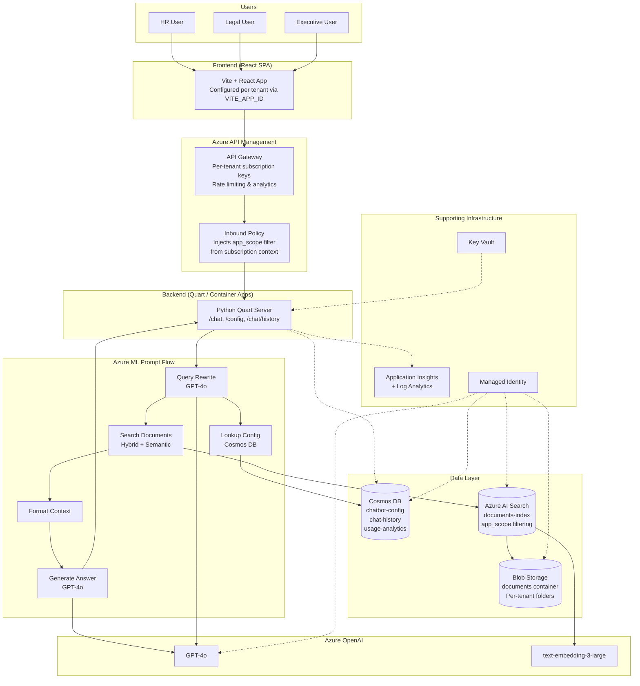

# Architecture

## Overview

The Multi-Tenant RAG Platform enables multiple isolated chatbot tenants to share a single Azure infrastructure deployment. Each tenant has its own system prompt, document corpus, and UI configuration while sharing compute, search, and AI resources.

## Architecture Diagram



## Component Descriptions

### Azure AI Search

The central search engine indexing all tenant documents. Key features:

- **Hybrid search**: Combines keyword (BM25) and vector similarity search for high-quality retrieval.
- **Semantic ranking**: Re-ranks results using a cross-encoder for improved relevance.
- **app_scope field**: A `Collection(Edm.String)` field on every document chunk. OData filters like `app_scope/any(s: search.in(s, 'hr-chatbot'))` enforce tenant isolation at query time.
- **Integrated vectorization**: Uses Azure OpenAI `text-embedding-3-large` (3072 dimensions) via a built-in vectorizer, so queries are vectorized automatically.
- **Indexer pipeline**: A blob storage data source with a skillset that splits documents into chunks and generates embeddings.

### Cosmos DB

Stores three types of data across separate containers:

| Container | Partition Key | Purpose |
|---|---|---|
| `chatbot-config` | `/chatbotId` | Per-tenant configuration: system prompt, temperature, max_tokens, UI settings, app_scopes |
| `chat-history` | `/sessionId` | Conversation history with 30-day TTL |
| `usage-analytics` | `/chatbotId` | Query logs and usage metrics with 90-day TTL |

Uses serverless mode in dev/staging and autoscale provisioned throughput in production.

### Azure API Management (APIM)

The API gateway layer providing:

- **Per-tenant subscription keys**: Each chatbot has its own APIM product and subscription.
- **Filter injection**: An inbound policy reads the subscription context and injects the `app_scope` OData filter into the request, preventing tenants from querying other tenants' documents.
- **Rate limiting**: Per-subscription rate limits protect the backend from abuse.
- **Analytics**: Per-subscription usage metrics for billing and monitoring.

### Prompt Flow (Azure ML)

The RAG orchestration pipeline running as a managed online endpoint:

1. **Query Rewrite**: GPT-4o rewrites the user's question for better search retrieval, incorporating chat history for context.
2. **Search Documents**: Executes hybrid search against AI Search with the tenant's app_scope filter.
3. **Lookup Config**: Retrieves the tenant's system prompt and generation parameters from Cosmos DB.
4. **Format Context**: Formats search results into a structured context block with citations.
5. **Generate Answer**: GPT-4o generates the final answer using the tenant's system prompt and retrieved context.

### Application Layer

- **Backend**: Python Quart server serving the REST API (`/chat`, `/config/<app_id>`, `/chat/history`). Runs in Azure Container Apps with a user-assigned managed identity.
- **Frontend**: React SPA built with Vite. Configured per tenant at build time via the `VITE_APP_ID` environment variable. Communicates with the backend through APIM.

### Supporting Infrastructure

- **Managed Identity**: A user-assigned managed identity used by all services for passwordless authentication (RBAC).
- **Key Vault**: Stores secrets that cannot use RBAC (e.g., external API keys). Access controlled via RBAC (Key Vault Secrets User role).
- **Application Insights + Log Analytics**: Centralized logging, distributed tracing, and performance monitoring.

---

## Data Flow

### User Query Flow

```
1. User sends message in the React frontend
2. Frontend sends POST /chat to APIM with subscription key
3. APIM inbound policy:
   a. Validates subscription key
   b. Identifies the tenant from the subscription context
   c. Injects app_scope filter into the request body
4. Request reaches the Quart backend
5. Backend invokes Prompt Flow:
   a. Query Rewrite: GPT-4o rewrites the query for search
   b. Search Documents: Hybrid search with app_scope filter
   c. Lookup Config: Retrieves tenant's system prompt
   d. Format Context: Structures search results as citations
   e. Generate Answer: GPT-4o produces the final answer
6. Backend streams the response back through APIM to the frontend
7. Frontend renders the answer with citation references
```

### Document Ingestion Flow

```
1. Upload documents to Blob Storage under <chatbot-id>/ prefix
2. Set app_scope metadata on each blob
3. AI Search indexer detects new/updated blobs (runs every 5 minutes)
4. Indexer pipeline:
   a. Extracts text content from documents
   b. Splits content into 2000-character chunks with 500-char overlap
   c. Generates embeddings via Azure OpenAI
   d. Writes chunks to the search index with app_scope from blob metadata
5. Documents are now searchable by the appropriate tenant(s)
```

---

## Security Model

### Tenant Isolation via app_scope

The `app_scope` field is the primary mechanism for multi-tenant data isolation:

1. **At ingestion**: Each document blob has an `app_scope` metadata tag set to the chatbot ID(s) that should have access.
2. **At indexing**: The AI Search indexer maps blob metadata to the `app_scope` field on index documents.
3. **At query time**: The APIM inbound policy injects an OData filter (`app_scope/any(s: search.in(s, '<chatbot-id>'))`) based on the subscription context. This filter cannot be overridden by the client.
4. **Shared documents**: Documents accessible to multiple tenants have multiple values in their `app_scope` field (e.g., `["hr-chatbot", "legal-chatbot"]`).

### APIM Subscription Isolation

- Each tenant has its own APIM product and subscription key.
- The subscription key determines which `app_scope` filter is injected.
- Tenants cannot forge or override the filter because it is set server-side by the APIM policy.
- Rate limiting is applied per subscription to prevent resource abuse.

### Authentication and Authorization

- All Azure service-to-service communication uses a user-assigned managed identity with RBAC roles.
- No shared keys or connection strings in application code.
- Key Vault stores any secrets that cannot use RBAC-based access.
- The frontend communicates through APIM, which handles authentication via subscription keys.

---

## Multi-Tenancy Model

| Aspect | Approach |
|---|---|
| Compute | Shared (single Container App, single Prompt Flow endpoint) |
| Search index | Shared (single index with app_scope filtering) |
| Document storage | Shared container with per-tenant folder prefixes |
| Configuration | Per-tenant (separate Cosmos DB documents) |
| API access | Per-tenant (separate APIM subscriptions) |
| Chat history | Per-tenant (partitioned by sessionId, filtered by chatbotId) |
| UI/Branding | Per-tenant (configured via Cosmos DB: colors, welcome message, logo) |

This is a **shared infrastructure, logically isolated** multi-tenancy model. It minimizes cost and operational overhead while maintaining strong data isolation through search filters enforced at the API gateway layer.

---

## Scaling Considerations

### Azure AI Search

- **Basic SKU** (dev/staging): 1 replica, 1 partition. Sufficient for development and testing.
- **Standard SKU** (production): Scale replicas for higher query throughput (each replica handles ~15 QPS for semantic search). Add partitions to increase index storage capacity.

### Cosmos DB

- **Serverless** (dev/staging): Pay-per-request, no minimum cost.
- **Autoscale provisioned** (production): Scales automatically from 100-1000 RU/s per container.

### Container Apps

- Configure min/max replicas based on expected concurrent users.
- Use KEDA scaling rules based on HTTP request count or queue length.

### Prompt Flow Endpoint

- Start with 1 instance of `Standard_DS3_v2`.
- Scale instances based on request latency metrics.
- Consider deploying separate endpoints per tenant if a single tenant requires guaranteed capacity.

### Azure OpenAI

- GPT-4o: 30K TPM (GlobalStandard) shared across all tenants.
- Embeddings: 120K TPM (Standard) for indexing and query vectorization.
- Monitor token usage per tenant via Application Insights custom metrics.
- Request quota increases through the Azure Portal if needed.
